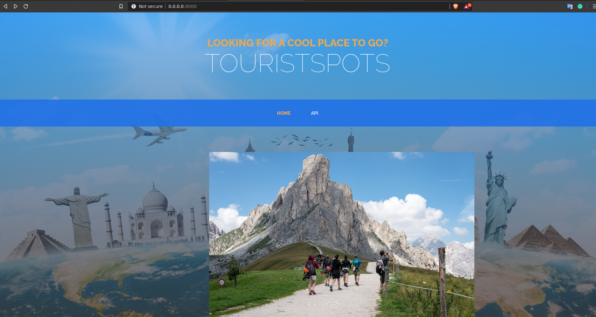
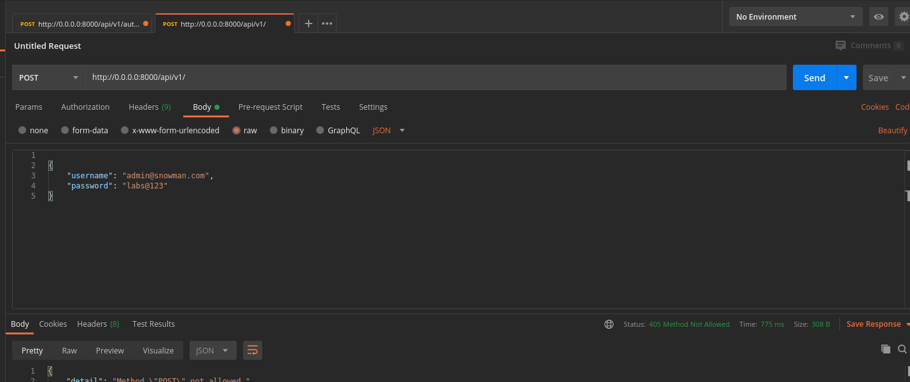
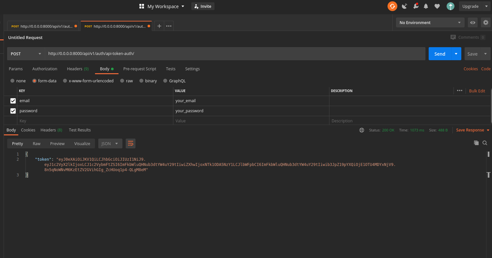
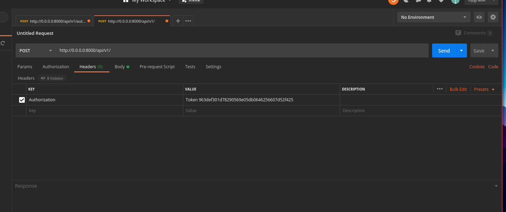
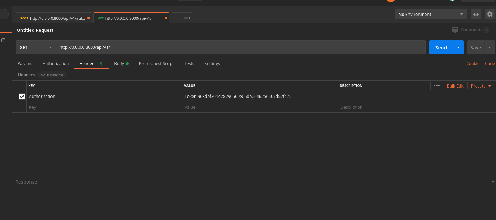
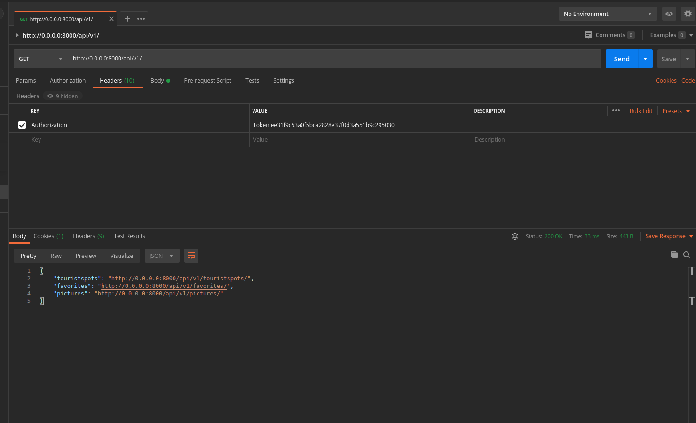
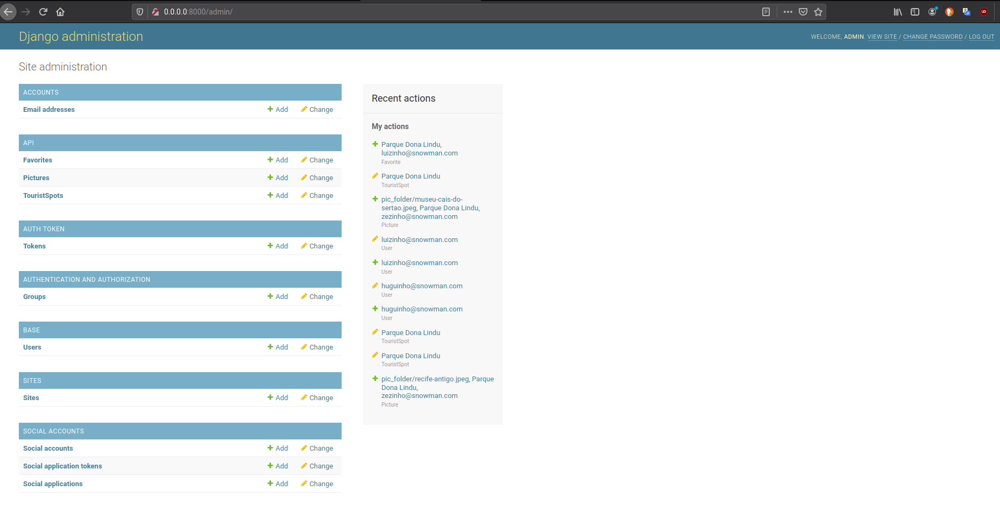
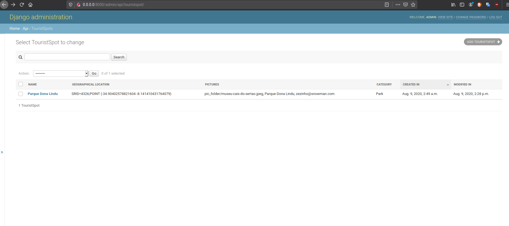
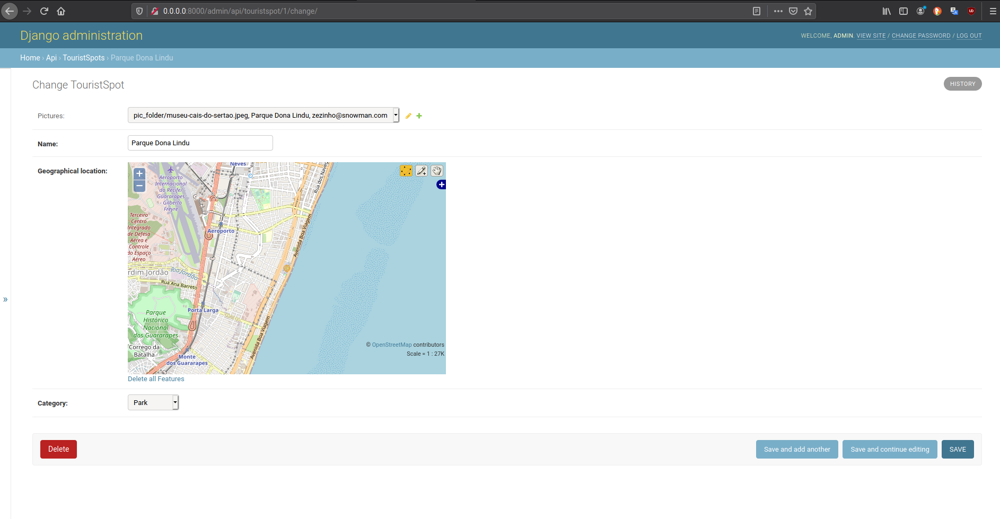
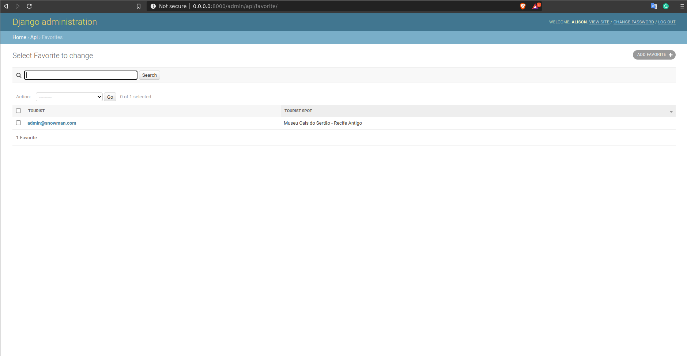

# snowman

An application for users to create and explore tourist spots on a map.

Application available at: https://touristspots.herokuapp.com


[](https://codecov.io/gh/alisonamerico/snowman)
[](https://pyup.io/repos/github/alisonamerico/snowman/)
[](https://pyup.io/repos/github/alisonamerico/snowman/)

Processes used in project development:

Continuous Delivery:

- Integration with Poetry, Github(Actions) and Pyup

- Automatic Deploy for Heroku

- Pytest: To set up and build automated tests for Django.

- Codecov: For Test Coverage

- python-decouple: To decouple application instance settings.

- Docker: Run applications by using containers.

Dependencies used in the project:

```toml
[tool.poetry.dependencies]
python = "^3.8"
django = "^3.0.8"
gunicorn = "^20.0.4"
python-decouple = "^3.3"
dj-database-url = "^0.5.0"
psycopg2-binary = "^2.8.5"
dj-static = "^0.0.6"
djangorestframework = "^3.11.0"
djangorestframework-jwt = "^1.11.0"
django-cors-headers = "^3.4.0"
Pillow = "^7.2.0"
djangorestframework-gis = "^0.15"
django-filter = "^2.3.0"

[tool.poetry.dev-dependencies]
flake8 = "^3.8.3"
autopep8 = "^1.5.3"
pytest-django = "^3.9.0"
pytest-cov = "^2.10.0"
codecov = "^2.1.8"
```

## Prerequisite Installed:

- Docker
- Docker Compose

For Linux(Ubuntu):
https://docs.docker.com/install/linux/docker-ce/ubuntu/#install-docker-engine---community-1

For Mac:
https://docs.docker.com/docker-for-mac/install/

For Windows:
https://docs.docker.com/docker-for-windows/install/



## How to execute:

```console
git clone https://github.com/alisonamerico/snowman.git
cd snowman
cp contrib/env-sample .env
docker-compose build
docker-compose up or docker-compose up -d
```

Create SuperUser:

```console
docker-compose run web python manage.py createsuperuser
```

Inform:

```console
 - email
 - password
```

How to generate a token:



Url:

```console
http://0.0.0.0:8000/api/v1/auth/api-token-auth/
```

To update the token:

```console

http://0.0.0.0:8000/api/v1/auth/api-token-refresh/
```

Enter email and password created:

```console
 - email
 - password
```

Method HTTP:

```console
POST
```

Generated token:



Copy the generated token, enter the key and value in Headers:



```console
Key:
Authorization

Value:
JWT + key genered
```

To access list of available urls:

```console
http://0.0.0.0:8000/api/v1/
```



API Root:

```console
http://0.0.0.0:8000/api/v1/touristspots/
http://0.0.0.0:8000/api/v1/favorites/
```



Run the tests:

```console
docker-compose run web python manage.py pytest touristspots --cov=touristspots
```

Screenshots admin:



Admin Touristspots:



Admin Touristspots Detail:


Admin Favorite


Example of json created:

```json
{
  "count": 3,
  "next": null,
  "previous": null,
  "results": [
    {
      "id": 3,
      "picture": "http://0.0.0.0:8000/media/pic_folder/parque-dona-lindu.jpeg",
      "name": "Parque Dona Lindu",
      "geographical_location": {
        "type": "Point",
        "coordinates": [-34.9040816111268, -8.141266676521594]
      },
      "category": "PARK",
      "created": "2020-07-26T13:47:28.802659Z",
      "modified": "2020-07-26T13:47:28.802749Z"
    },
    {
      "id": 2,
      "picture": "http://0.0.0.0:8000/media/pic_folder/teatro-santa-isabel.jpeg",
      "name": "Teatro Santa Isabel - Recife",
      "geographical_location": {
        "type": "Point",
        "coordinates": [-34.878362412362975, -8.060722137203351]
      },
      "category": "THEATER",
      "created": "2020-07-26T02:55:29.902770Z",
      "modified": "2020-07-26T13:49:09.173864Z"
    },
    {
      "id": 1,
      "picture": "http://0.0.0.0:8000/media/pic_folder/museu-cais-do-sertao.jpeg",
      "name": "Museu Cais do Sertão - Recife Antigo",
      "geographical_location": {
        "type": "Point",
        "coordinates": [-34.87008511534667, -8.060716825786317]
      },
      "category": "MUSEUM",
      "created": "2020-07-24T20:17:07.721895Z",
      "modified": "2020-07-26T13:49:29.112867Z"
    }
  ]
}
```

When you’re done, don’t forget to close down your Docker container.

```console
docker-compose down
```
