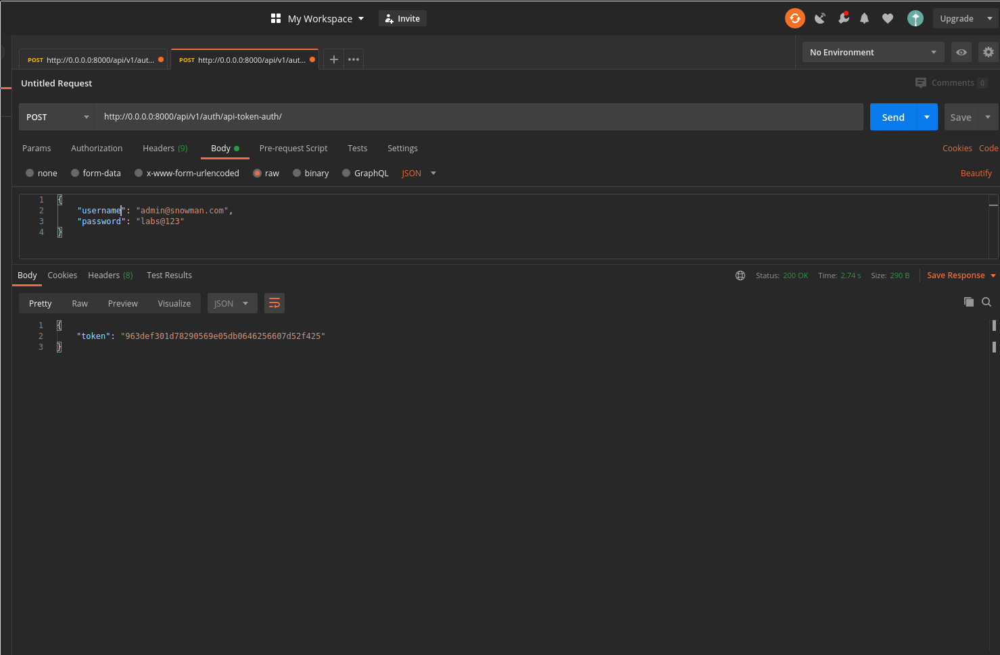

# snowman

An application for users to create and explore tourist spots on a map.

Application available at: https://touristspots.herokuapp.com


[](https://codecov.io/gh/alisonamerico/snowman)
[](https://pyup.io/repos/github/alisonamerico/snowman/)
[](https://pyup.io/repos/github/alisonamerico/snowman/)

Processes used in project development:

Continuous Delivery:

- Integration with Poetry, Github(Actions) and Pyup

- Automatic Deploy for Heroku

- Pytest: To set up and build automated tests for Django.

- Codecov: For Test Coverage

- python-decouple: To decouple application instance settings.

- Docker: Run applications by using containers.

Dependencies used in the project:

```toml
[tool.poetry]
name = "snowman"
version = "0.1.0"
description = ""
authors = ["alisonamerico <alison.americo@gmail.com>"]

[tool.poetry.dependencies]
python = "^3.8"
django = "^3.0.8"
gunicorn = "^20.0.4"
python-decouple = "^3.3"
dj-database-url = "^0.5.0"
psycopg2-binary = "^2.8.5"
dj-static = "^0.0.6"
djangorestframework = "^3.11.0"
django-cors-headers = "^3.4.0"
Pillow = "^7.2.0"
djangorestframework-gis = "^0.15"
django-filter = "^2.3.0"
dj-rest-auth = "^1.1.1"
django-allauth = "^0.42.0"

[tool.poetry.dev-dependencies]
flake8 = "^3.8.3"
autopep8 = "^1.5.3"
pytest-django = "^3.9.0"
pytest-cov = "^2.10.0"
codecov = "^2.1.8"
```

## Prerequisite Installed:

- Docker
- Docker Compose

For Linux(Ubuntu):
https://docs.docker.com/install/linux/docker-ce/ubuntu/#install-docker-engine---community-1

For Mac:
https://docs.docker.com/docker-for-mac/install/

For Windows:
https://docs.docker.com/docker-for-windows/install/


## How to execute:

```console
git clone https://github.com/alisonamerico/snowman.git
cd snowman
cp contrib/env-sample .env
docker-compose build
docker-compose up or docker-compose up -d
```

Create SuperUser:

```console
docker-compose run web python manage.py createsuperuser
```

Inform:

```console
 - email
 - password
```

How to generate a token:


Url:

```console
http://0.0.0.0:8000/api/v1/auth/api-token-auth/
```

Enter email and password created:

Obs.: I'm using a custom user, so enter your email in the username field.

```json
{
  "username": "admin@snowman.com",
  "password": "labs@123"
}
```

Method HTTP:

```console
POST
```

Generated token:



Copy the generated token, enter the key and value in Headers:


```console
Key:
Authorization

Value:
Token + key genered
```

To access list of available urls:

```console
http://0.0.0.0:8000/api/v1/
```


API Root:

```console
http://0.0.0.0:8000/api/v1/touristspots/
http://0.0.0.0:8000/api/v1/favorites/
http://0.0.0.0:8000/api/v1/pictures/
```


Run the tests:

```console
docker-compose run web pytest touristspots --cov=touristspots
```

Screenshots admin:


Admin Touristspots:


Admin Touristspots Detail:


Admin Favorite


Admin Picture


Example of json created:

```json
{
  "count": 1,
  "next": null,
  "previous": null,
  "results": [
    {
      "id": 1,
      "name": "Parque Dona Lindu",
      "geographical_location": {
        "type": "Point",
        "coordinates": [-34.90402578821604, -8.14141043176408]
      },
      "category": "PARK",
      "pictures": [
        {
          "id": 3,
          "picture": "http://0.0.0.0:8000/media/pic_folder/parque-dona-lindu.jpeg",
          "tourist_spot": "Parque Dona Lindu",
          "user": "Zezinho"
        },
        {
          "id": 4,
          "picture": "http://0.0.0.0:8000/media/pic_folder/recife-antigo.jpeg",
          "tourist_spot": "Parque Dona Lindu",
          "user": "Zezinho"
        },
        {
          "id": 5,
          "picture": "http://0.0.0.0:8000/media/pic_folder/museu-cais-do-sertao.jpeg",
          "tourist_spot": "Parque Dona Lindu",
          "user": "Zezinho"
        }
      ],
      "created": "2020-08-09T02:49:48.523116Z",
      "modified": "2020-08-09T14:28:59.968699Z"
    }
  ]
}
```

## Allow login with Facebook


Access the link, login with your Facebook account, to generate the `Access Token`:
https://developers.facebook.com/tools/explorer/3227255577337637/

Endpoint:


```console
http://0.0.0.0:8000/api/v1/dj-rest-auth/facebook/
```

Copy the token generated by the link and paste in `Access token`.

You will need the `Client id` and `Secret key` of the application created on Facebook, to insert in the Django Admin.

Obs.: These values are not public, they will be provided for specific people to access.

### Admin:

In the admin go to `Sites` and change `example.com` to `http://0.0.0.0:8000/`:


Change the fields to `http://0.0.0.0:8000/` and save:


Go back to the admin's `Home` page and go to`Social applications`:


Select the provider, which will be `Facebook`, choose the name: `Touristspot`, insert the `client id` and `secret key` and then switch from `Available sites` to `Chosen sites` and save:


Access endpoint:

```console
http://0.0.0.0:8000/api/v1/dj-rest-auth/facebook/
```


When you’re done, don’t forget to close down your Docker container! ;)

```console
docker-compose down
```
